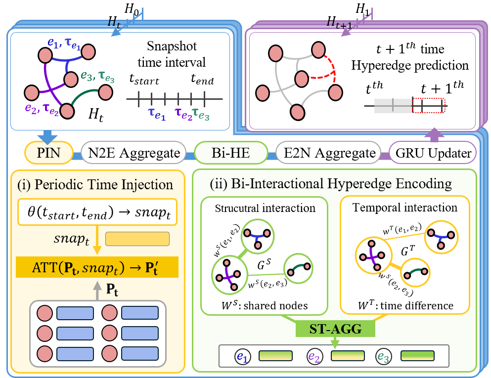

# LINCOLN: Learning High-Order Dynamics of Real-World Networks 

This repository provides an implementation of LINCOLN as described in the paper: <u>LINCOLN: Learning High-Order Dynamics of Real-World Networks</u>.
## Authors

- Yunyong Ko (yyko@cau.ac.kr)
- Da Eun Lee (ddanable@hanyang.ac.kr)
- Song Kyung Yu (ssong915@hanyang.ac.kr)
- Sang-Wook Kim (wook@hanyang.ac.kr)

## Overview

<p align="center">

</p>

- **Observations**
    - We observe that high-order relations tend to (O1) have a structural and temporal influence on other relations in a short term and (O2) periodically re-appear in a long term.
    
- **Method**
    - We propose a novel dynamic hypergraph learning method, Lincoln, that effectively captures long-term and short term patterns of high-order relations in real-world networks.
    
- **Evaluation**
    - Via extensive experiments on seven real-world datasets, we demonstrate that Lincoln outperforms nine state-of-the-art methods in the dynamic hyperedge prediction task.


## Datasets
|Name|# of nodes|# of hyperedges|Range|Snapshot frequency|# of snapshots|
|:------:|:------:|:------:|:---:|:------:|:------:|
|Email-enron|143|10,883|3 Years 5 Months|Monthly|40|
|Email-eu|979|234,760|2 Years 2 Months|Weekly|78|
|Tags|3,021|271,233|8 Years 6 Months|Monthly|86|
|Thread|90,054|192,947|7 Years 6 Months|Monthly|86|
|Contact-primary|242|106,879|32.4 Hours|Quarter of a Hour|71|
|Contact-high|327|172,035|4.2 Days|Quarter of a Hour|164|
|Congress|1,718|260,851|33 Years 6 Months|Quarter of a Year|98|

We provide 7 real-world datasets for our new benchmark task at [Here](https://drive.google.com/file/d/11gKvgjvydcGJHnKt8zK_WvK_WNAUJgAr/view?usp=drive_link) and sampling negative samples code `/data/sampler.py`

```
# File Organization
[ dataset name ]
|__ cns_[dataset_name].pt
|__ mns_[dataset_name].pt
|__ sns_[dataset_name].pt              # negative hyperedges samples used for training and evaluation
|__ hyper_[datset_name].csv               # original hypergraph dataset
|__ new_hyper_[datset_name].csv               # reindexed hypergraph dataset
```

## Code
The source code used in the paper is available at ```./LINCOLN/```.

### Execution
```
python main.py --dataset_name [name of dataset] --snapshot_size [size of snapshot for each datset] 
```
More details about arguments are described in ```./LINCOLN/utils.py```.

### Environment
Our code runs on the Intel i7-7700k CPU with 64GB memory and  NVIDIA RTX 2080 Ti GPU, installed with CUDA 12.2 and cuDNN
8.2.1., with the following packages installed in `environment.yaml`

